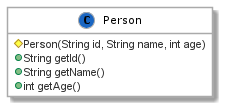

# [Paradigmas de Programação 2020/2021](https://elearning.ual.pt/course/view.php?id=1946), [UAL](https://autonoma.pt/)

## Laboratório 6: *Stream & Lambda*

Este laboratório continua com exercícios sobre a interface funcional em Java (JDK >= 8).

### Documentação relevante

- [`java.util.function`](https://docs.oracle.com/javase/8/docs/api/java/util/function/package-summary.html)
- [`java.util.stream`](https://docs.oracle.com/en/java/javase/11/docs/api/java.base/java/util/stream/Stream.html)

### Contexto

Vimos que Java permite alguma abordagem funcional através da declaração de interfaces com apenas um método abstrato. 

Para apoiar esta abordagem, a biblioteca Java distribui várias interfaces funcionais genéricas(ver documentação). Estas interfaces permitem definir argumentos que representam algoritmos arbitrários com interface padronizada, simplificando a escrita de código.

Além das intefaces funcionais, Java permite interagir com iteradores de coleções de forma simplificada através da abstração *Stream*. 

## Tarefas

## Tarefa 1
Defina um método estático `List<String> filterStrings(List<String> strings, Predicate<String> predicate)`, que seleciona *strings* de uma lista de acordo com um predicato, e retorna uma lista com a seleção.

Utilize a seguinte lista de *string*:

```java
List<String> strings = Arrays.asList(
        "As the asteroid hurtled toward earth, Becky was upset her dentist appointment had been canceled.",
        "Malls are great places to shop; I can find everything I need under one roof.",
        "The blue parrot drove by the hitchhiking mongoose.",
        "It was a really good Monday for being a Saturday.",
        "The sudden rainstorm washed crocodiles into the ocean."
);
```

a) Teste o método com os seguintes predicados:

- i) `string -> string.startsWith("A")`
- ii) `string -> string.length() > 10`
- iii) `strings, string -> string.split(" ").length > 8)`

b) Defina e teste os seguintes predicados:

- i) Strings com todas as palavras com 3 ou mais letras; 
- ii) *Strings* com um número par de letras `w` minúsculas.

## Tarefa 2

Considere a seguinte lista de registos académicos:


| Número | Nome  | Nota |
| ------ | ----- | ---- |
| 1      | Alice | 14   |
| 2      | Trudy | 17   |
| 3      | Bob   | 8    |
| 4      | Anna  | 12   |
| 5      | James | 15   |

a) Defina uma classe `StudentRecord` para representar a informação de cada registo.

b) Construa uma lista de `StudentRecord` com a informação na tabela.

c) Defina uma interface funcional `Consumer` para escrever o número e nota de cada registo no terminal. Teste a interface.

d) Defina uma interface funcionar `Predicate` para selecionar registos abaixo de 10. Escreva o número e nome de cada estudante selecionado.

### Tarefa 3
Considere a seguinte classe `Person`:



Considere a seguinte lista (`java.util.List`) de objetos `Person`:

```java
List<Person> people = Arrays.asList(
        new Person("1", "Alice", 28),
        new Person("2", "Trudy", 32),
        new Person("3", "Anna", 24),
        new Person("4", "Bob", 40),
        new Person("5", "James", 18)
);
```
Recorra a *Stream* e expressões lambda para responder às questões.

a) Apresente a contagem de pessoas cuja idade é igual ou superior à média na coleção.

b) Apresente o desvio padrão das idades na coleção.

c) Construa um mapa cuja chave é o `id` de cada pessoa, e o valor é o objeto pessoa. Mostre o conteúdo do mapa no terminal com o seguinte formato para cada registo: `id=Person(id, name, age)`


